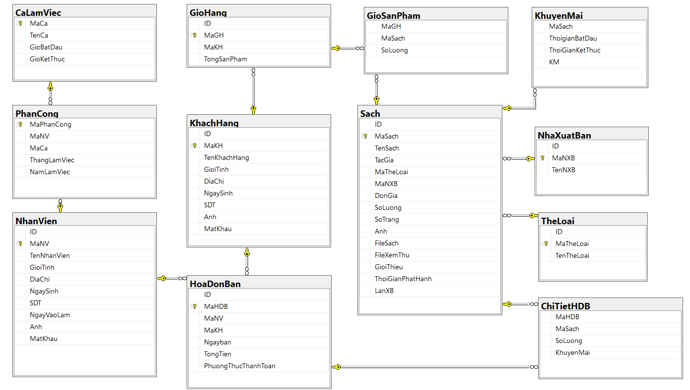

# BookStoreApp

## Giới Thiệu Về App

**BookStoreApp** là một ứng dụng quản lý bán sách được phát triển để hỗ trợ quản trị viên và người dùng trong việc quản lý sách, đơn hàng và giao dịch. Với một giao diện người dùng thân thiện và dễ sử dụng, **BookStoreApp** cung cấp các tính năng quản lý hiệu quả cho các cửa hàng bán sách trực tuyến. Người dùng có thể dễ dàng tìm kiếm sách, xem chi tiết, và thực hiện giao dịch, trong khi quản trị viên có thể theo dõi thông tin sản phẩm, đơn hàng và khách hàng.

## Video Demo

[](Demo/Demo_BookStore.mp4)

Xem video demo đầy đủ tại: [Demo BookStore App](Demo/Demo_BookStore.mp4)

## Screenshots

### Giao Diện Người Dùng

#### Trang Chủ

*Giao diện chính với danh sách sách nổi bật*


*Giao diện chính với tìm kiếm sách*

#### Chi Tiết Sách

*Trang chi tiết sách với thông tin cơ bản*


*Trang chi tiết sách với sách miễn phí*

#### Giỏ Hàng

*Giỏ hàng với danh sách sản phẩm*


*Giỏ hàng với danh sách sản phẩm*

#### Thanh Toán

*Trang thanh toán với thông tin giao hàng, tất cả sản phẩm trong giỏ hàng*


*Trang thanh toán khi mua trực tiếp không qua giỏ hàng*


*Xuất hóa đơn mua hàng ra Excel*

#### Thông Tin Tài Khoản

*Trang thông tin cá nhân*


*Trang cập nhật thông tin*

#### Lịch Sử Mua Hàng

*Danh sách đơn hàng đã mua*


*Chi tiết đơn hàng*


*Lịch sử mua*

#### Đăng Nhập/Đăng Ký

*Trang đăng nhập*


*Trang đăng ký tài khoản mới*

### Giao Diện Admin

#### Quản Lý Sản Phẩm

*Danh sách sản phẩm*


*Thêm/Sửa sản phẩm*


*Tìm kiếm, lọc sản phẩm*

#### Quản Lý Khách Hàng

*Danh sách khách hàng*


*Chi tiết thông tin khách hàng*

#### Quản Lý Khuyến Mãi

*Danh sách khuyến mãi*


*Thêm/Sửa khuyến mãi*

#### Thống Kê

*Thống kê doanh thu theo sách*


*Thống kê doanh thu theo ngày*

#### Báo Cáo

*Báo cáo doanh thu theo sách*


*Báo cáo chi tiêu khách hàng*

### Database

*ERD*

## Kiến Trúc Ứng Dụng

### Cấu Trúc Thư Mục
```
BookStoreApp/
├── Classes/                 # Chứa các class cốt lõi
├── ViewNguoiMua/           # Giao diện người dùng
├── Sign/                   # Xử lý đăng nhập/đăng ký
├── System/                 # Các class hệ thống
├── Images/                 # Tài nguyên hình ảnh
├── HomeFrm.cs             # Giao diện admin
└── Resources/             # Tài nguyên khác
```

### Các Class Chính
- **DataBaseProcess.cs**: Xử lý kết nối và tương tác với database
- **SanPham.cs**: Model cho sản phẩm
- **UserInfo.cs**: Model cho thông tin người dùng
- **DanhSachSanPham.cs**: Quản lý danh sách sản phẩm
- **Item.cs**: Model cho các item trong giỏ hàng
- **SelectedItem.cs**: Model cho item được chọn

## Chi Tiết Các Module

### Module Xác Thực (Sign/)
- **SignIn.cs**: Xử lý đăng nhập
  - Kiểm tra thông tin đăng nhập
  - Phân quyền người dùng
  - Lưu trạng thái đăng nhập
- **SignUp.cs**: Xử lý đăng ký
  - Kiểm tra thông tin đăng ký
  - Mã hóa mật khẩu
  - Tạo tài khoản mới

### Module Người Dùng (ViewNguoiMua/)
- **HomeView.cs**: Giao diện chính
  - Hiển thị sản phẩm
  - Tìm kiếm và lọc
  - Điều hướng
- **ChiTietSanPhamView.cs**: Chi tiết sản phẩm
  - Hiển thị thông tin chi tiết
  - Đánh giá và bình luận
  - Thêm vào giỏ hàng
- **GioHangView.cs**: Quản lý giỏ hàng
  - Thêm/xóa sản phẩm
  - Cập nhật số lượng
  - Tính tổng tiền
- **HoaDonView.cs**: Xử lý đơn hàng
  - Tạo đơn hàng mới
  - Xác nhận thanh toán
  - Lưu thông tin giao hàng
- **LichSuMua.cs**: Lịch sử mua hàng
  - Xem đơn hàng đã mua
  - Chi tiết đơn hàng
  - Trạng thái đơn hàng
- **ThongTinKH.cs**: Thông tin khách hàng
  - Cập nhật thông tin cá nhân
  - Đổi mật khẩu
  - Xem lịch sử giao dịch

### Module Database (Classes/)
- **DataBaseProcess.cs**: Xử lý database
  - Kết nối database
  - Thực thi truy vấn
  - Xử lý transaction
  - Quản lý connection pool
  - Xử lý lỗi và exception

## Chi Tiết Kỹ Thuật

### Xử Lý Database
```csharp
public class DataBaseProcess
{
    // Kết nối database
    public static string strConnect = "Data Source=DESKTOP-FTUKUSM;Initial Catalog=BookStoreApp;Integrated Security=True";
    
    // Các phương thức chính
    public SqlConnection GetConnection() { ... }
    public bool Exist(string sql) { ... }
    public void ExecuteQuery(string query, Dictionary<string, object> parameters) { ... }
    public DataTable DataReader(string sqlSelect) { ... }
    public int DataChange(string sql) { ... }
    public object ExecuteScalar(string sql) { ... }
}
```

### Xử Lý Transaction
```csharp
public (SqlConnection connection, SqlTransaction transaction) BeginTransaction()
{
    var connection = GetConnection();
    connection.Open();
    var transaction = connection.BeginTransaction();
    return (connection, transaction);
}
```

### Xử Lý Parameters
```csharp
public int ExecuteTransactionQuery(string query, Dictionary<string, object> parameters, SqlConnection connection, SqlTransaction transaction)
{
    using (SqlCommand command = new SqlCommand(query, connection, transaction))
    {
        if (parameters != null)
        {
            foreach (var param in parameters)
            {
                command.Parameters.AddWithValue(param.Key, param.Value ?? DBNull.Value);
            }
        }
        return command.ExecuteNonQuery();
    }
}
```

## Tính Năng Bảo Mật

### Xử Lý Kết Nối
- Sử dụng connection pool
- Đóng kết nối sau khi sử dụng
- Xử lý exception khi kết nối

### Xử Lý Parameters
- Sử dụng parameterized queries
- Tránh SQL injection
- Xử lý null values

### Transaction Management
- Sử dụng transaction để đảm bảo tính toàn vẹn dữ liệu
- Rollback khi có lỗi
- Commit khi thành công

## Tối Ưu Hóa

### Database
- Sử dụng connection pool
- Đóng kết nối sau khi sử dụng
- Sử dụng transaction khi cần thiết

### Memory Management
- Sử dụng using statement
- Dispose resources đúng cách
- Tránh memory leaks

### Performance
- Tối ưu queries
- Sử dụng index
- Cache data khi cần thiết

## Tính Năng Nổi Bật

### Đối Với Admin:

* **Quản lý sản phẩm**: Thêm, sửa, xóa sách trong cửa hàng.
* **Quản lý đơn hàng**: Theo dõi đơn hàng của khách hàng và trạng thái giao hàng.
* **Quản lý khách hàng**: Quản lý thông tin người dùng và các giao dịch của họ.
* **Báo cáo doanh thu**: Xem báo cáo tổng quan về doanh thu theo thời gian.

### Đối Với Người Dùng:

* **Duyệt sách**: Dễ dàng tìm kiếm và duyệt qua các thể loại sách khác nhau.
* **Giỏ hàng**: Thêm sách vào giỏ hàng và thực hiện thanh toán dễ dàng.
* **Xem chi tiết sách**: Xem thông tin chi tiết, đánh giá và các thông tin bổ sung về sách.
* **Đánh giá và nhận xét**: Để lại nhận xét và đánh giá cho các sách đã mua.

## Công Nghệ Nền Tảng

* **Ngôn ngữ lập trình**: C#, WinForms
* **Cơ sở dữ liệu**: SQL Server (hoặc tùy chỉnh nếu có)
* **Thư viện**: Guna.UI2 (Để tạo giao diện người dùng hiện đại)
* **Quản lý mã nguồn**: Git (và GitHub)

## Hướng Dẫn Cài Đặt Dự Án

### Cài Đặt Yêu Cầu:

1. **Visual Studio 2022** hoặc phiên bản mới hơn.
2. **.NET Framework 4.7.2** trở lên.
3. **SQL Server** hoặc bất kỳ cơ sở dữ liệu tương thích nào (nếu sử dụng cơ sở dữ liệu khác).
4. **Cài đặt Guna.UI2**: Sử dụng NuGet Package Manager trong Visual Studio để cài đặt Guna.UI2.

### Cài Đặt Dự Án:

1. **Clone dự án từ GitHub**:

   ```bash
   git clone https://github.com/Minhquan69/BookStoreApp.git
   ```

2. **Mở dự án trong Visual Studio**:

   * Mở `BookStoreApp.sln` trong Visual Studio.

3. **Cài đặt các thư viện phụ thuộc**:

   * Mở **NuGet Package Manager** trong Visual Studio và cài đặt các gói phụ thuộc nếu chưa cài.
   * Cài đặt `Guna.UI2` qua NuGet:

     ```bash
     Install-Package Guna.UI2
     ```

4. **Cấu hình Cơ Sở Dữ Liệu**:

   * Tạo cơ sở dữ liệu trong SQL Server.
   * Cập nhật chuỗi kết nối trong tệp `App.config`:

     ```xml
     <connectionStrings>
       <add name="DbConnection" connectionString="Data Source=SERVER_NAME;Initial Catalog=BookStoreDb;Integrated Security=True" providerName="System.Data.SqlClient" />
     </connectionStrings>
     ```

   * Chạy file `Database/BookStore.sql` để tạo cơ sở dữ liệu và dữ liệu mẫu.
   * **Lưu ý quan trọng**: Sau khi chạy file SQL, cần cập nhật các thông tin sau để hiển thị đúng trên giao diện:
     - Sách sắp ra mắt: Cập nhật ngày phát hành (ReleaseDate) cho các sách sắp ra mắt
     - Sách khuyến mãi: Cập nhật thời gian khuyến mãi (StartDate và EndDate) trong bảng Promotions
     - Sách mới: Cập nhật ngày thêm sách (CreatedDate) để hiển thị trong mục sách mới


5. **Chạy Ứng Dụng**:

   * Sau khi cài đặt và cấu hình xong, bạn có thể chạy ứng dụng từ Visual Studio.
   * Đảm bảo rằng cơ sở dữ liệu đã được khởi tạo đúng cách trước khi chạy ứng dụng.

### Cấu Hình và Tùy Chỉnh:

* Bạn có thể thay đổi các giá trị trong file cấu hình `App.config` để tùy chỉnh ứng dụng theo yêu cầu của bạn.


